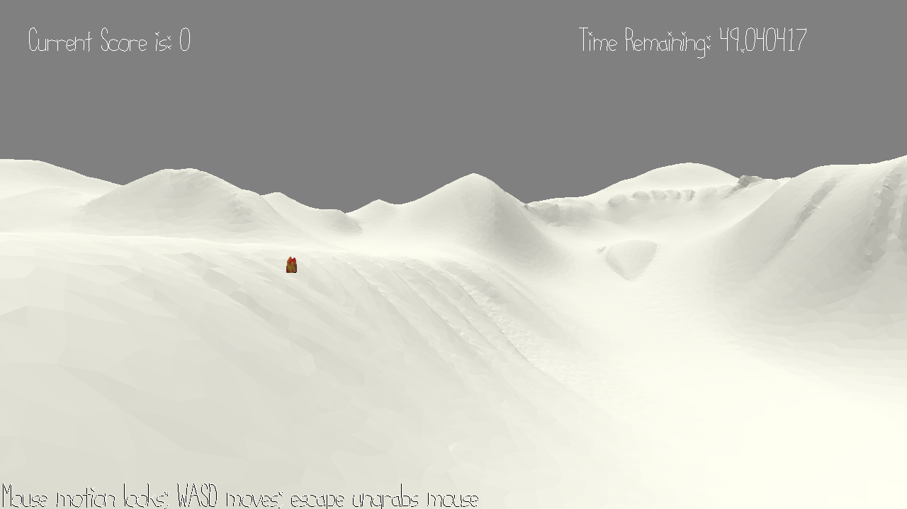

# Frozen Treasure Hunt

Author: Zhengjia Cao, Lingxi Zhang

Design: Move the player around in the terrain. Go find the lost treasures in the limited time.

Screen Shot:

How To Play:

Use `w/a/s/d` keys to move around. Use `SPACE` key to get the treasure.

Sources:
- Music:

BGM:
Forest Walk by Alexander Nakarada | https://www.serpentsoundstudios.com
Music promoted by https://www.chosic.com/free-music/all/
Attribution 4.0 International (CC BY 4.0)
https://creativecommons.org/licenses/by/4.0/

- WalkMesh: 

Referenced from: 
1. https://github.com/wdlzz926/GrubDash-Simulator/blob/master/WalkMesh.cpp
2. https://github.com/jianrongyu16/Planet-Delivery-Man/blob/master/WalkMesh.cpp
Used with modification.

- Terrain model: 
https://www.cgtrader.com/items/2015853/download-page

This game was built with [NEST](NEST.md).

